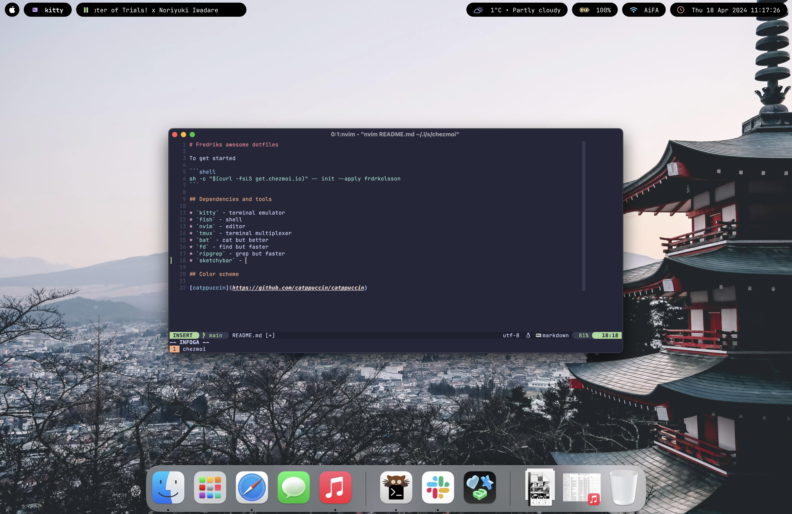

# Fredriks awesome dotfiles

Dotfiles managed with [chezmoi](https://www.chezmoi.io/) with encrypted secrets via Bitwarden and age.



## Quick Start on a New Machine

### 1. Initialize chezmoi with encrypted secrets

```shell
chezmoi init --apply https://github.com/frdrkolsson/dotfiles.git
```

This will:
- Clone the dotfiles repository
- Decrypt encrypted files using the age private key (you'll be prompted if needed)
- Apply all configurations to your home directory
- Auto-generate `~/.config/fish/secrets.fish` from the encrypted template
- **Automatically run the Bitwarden setup script** (see step 2 below)

### 2. Bitwarden Setup (Interactive during chezmoi apply)

The chezmoi initialization automatically runs a setup script that will prompt you for:

1. **Bitwarden Server URL** - Enter your self-hosted or cloud Bitwarden URL
   - Example: `https://vault.bitwarden.com` (official)
   - Or your self-hosted instance: `https://your-server.example.com`

2. **Bitwarden Login** - Your email and password when prompted

The script then:
- ✅ Configures the Bitwarden CLI with your server
- ✅ Stores your session token in macOS Keychain
- ✅ Skips re-login if already configured on that machine

**What you need to do when prompted:**
1. Enter your Bitwarden server URL
2. Enter your Bitwarden credentials (email and password)

If you need to manually trigger the setup again:
```shell
chezmoi apply run_onchange_setup-bitwarden.sh.tmpl
```

### 3. Verify the setup

Open a new fish shell and verify secrets are loaded:

```fish
echo $OPENAI_API_KEY
echo $TAVILY_API_KEY
```

## How Secrets Work

### Encrypted in Git (Safe to Commit)
- `dot_config/fish/secrets.fish.tmpl.age` - Encrypted template with Bitwarden fetch logic

### Generated Locally (Never Committed)
- `~/.config/fish/secrets.fish` - Auto-generated unencrypted file (in `.chezmoiignore`)
- Contains actual secret values fetched from Bitwarden at template generation time

### Security Flow
1. Chezmoi decrypts `secrets.fish.tmpl.age` using the local age private key (`~/.config/chezmoi/key.txt`)
2. Template is processed to generate `~/.config/fish/secrets.fish` with actual values
3. Fish shell sources this file at startup to set environment variables
4. Secrets are never stored in git, only the encrypted template

## Dependencies and Tools

* `git` - Version control
* `chezmoi` - Dotfiles manager
* `fish` - Shell
* `mise` - Runtime version manager (Node, Ruby, etc.)
* `bw` - Bitwarden CLI (installed globally via mise in Node)
* `nvim` - Text editor
* `bat` - Cat alternative
* `fd` - Find alternative
* `ripgrep` - Grep alternative
* `sketchybar` - macOS status bar (macOS only)
* `starship` - Shell prompt
* `age` - Encryption tool (for chezmoi secrets)

## Color Scheme

[catppuccin](https://github.com/catppuccin/catppuccin) - Soothing pastel theme
